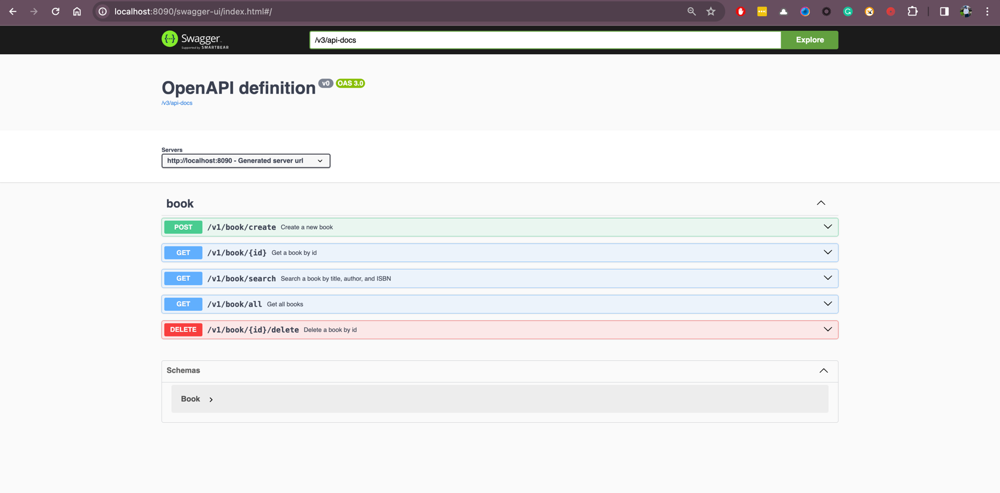

# 📚 Spring Boot Book Service

## 📝 Description
This is a simple Spring Boot application that exposes a REST API to manage a book library. It's a great starting point for learning about Spring Boot, REST APIs, and database integration.

## 📋 Requirements

- ☕ Java 17
- 🏗️ Maven
- 🐳 Docker
- 🧩 Docker-compose
- 📬 Postman

## 🚀 How to Run

### ▶️ Run the Application Locally
To run the application directly on your machine, use the following Maven command:
```shell
mvn spring-boot:run
```

### 🐳 Run the Application with Docker-compose

This application uses MySQL as the backend database. To run the application along with MySQL in Docker containers, use the following command:
```shell
docker-compose up -d
```

## 📖 Swagger API Documentation

🔍 Access the OpenAPI documentation to explore and test the API endpoints:

- Swagger UI: [http://localhost:8090/swagger-ui/index.html](http://localhost:8090/swagger-ui/index.html)

- API Docs in JSON format: [http://localhost:8090/v3/api-docs](http://localhost:8090/v3/api-docs)


